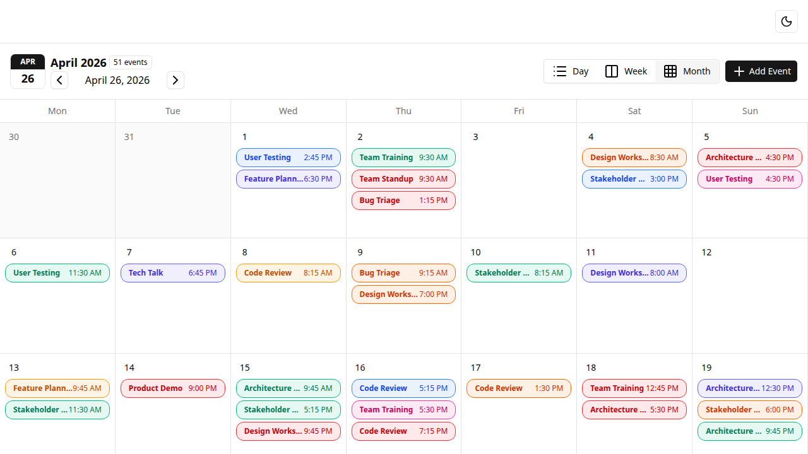
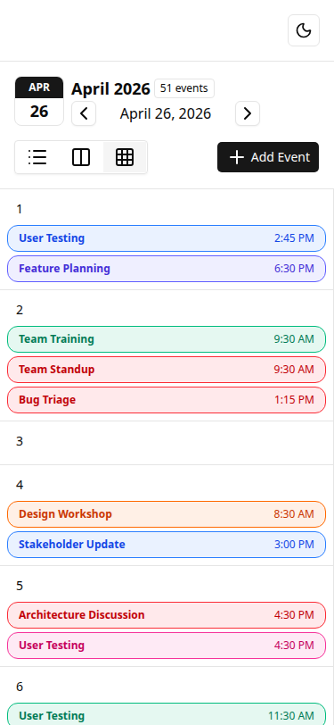
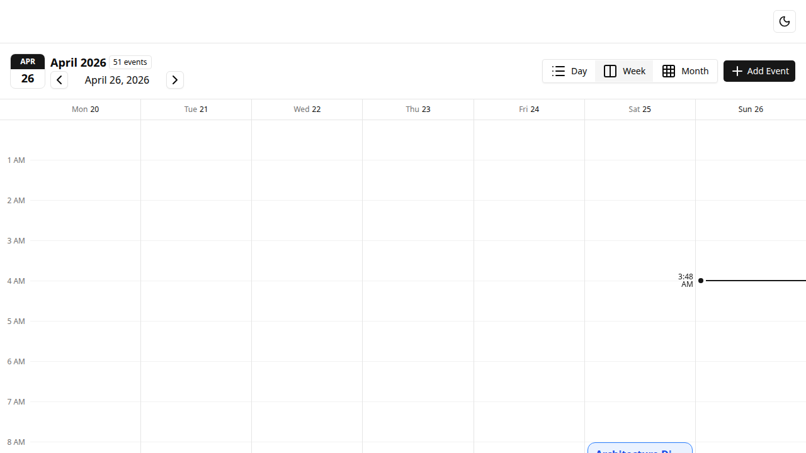
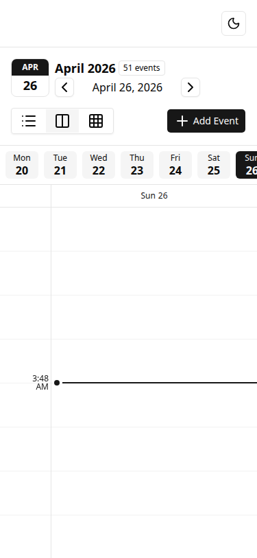
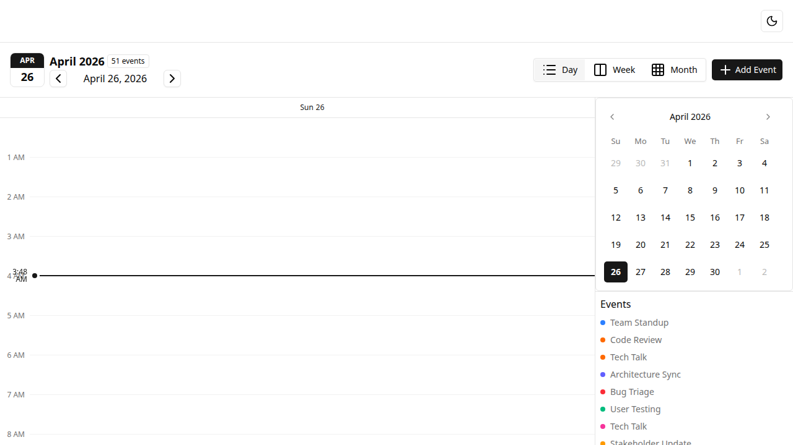
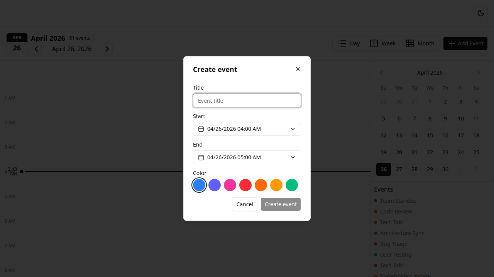
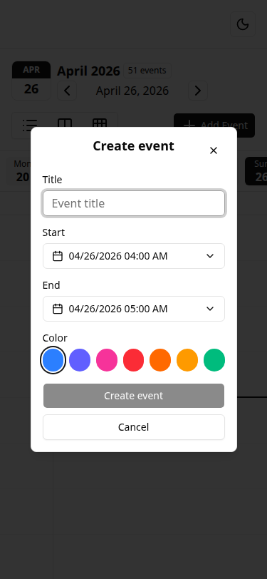
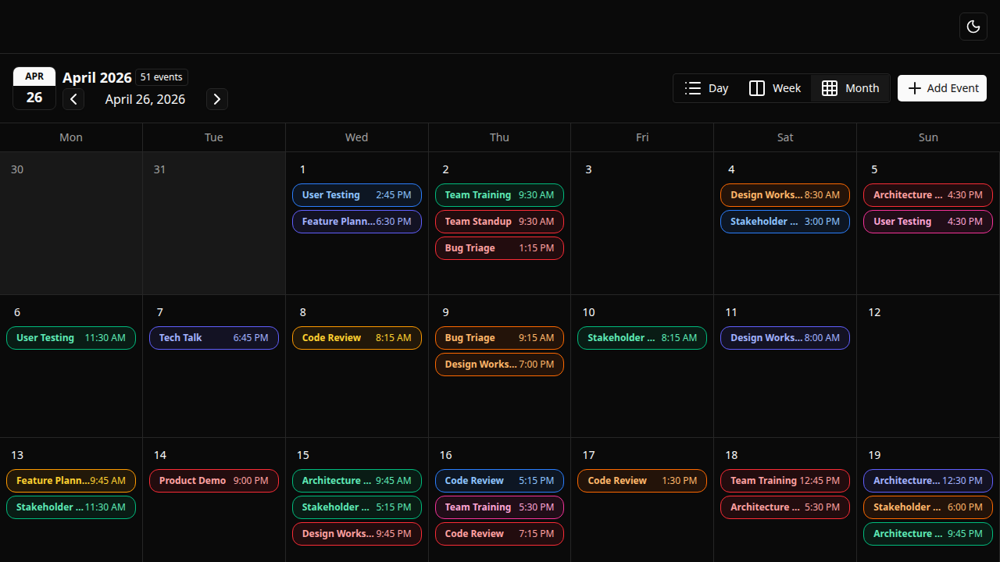
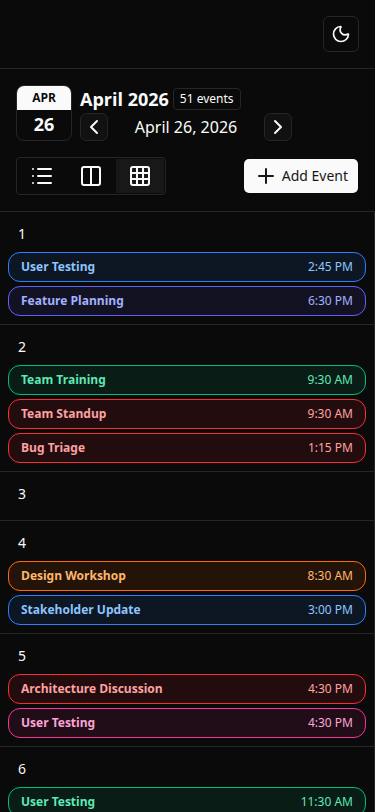

# Calendar Spartan

An accessible, responsive calendar with day / week / month views, built with **Angular 21**, **spartan-ng** and **Tailwind 4**. Events persist to `localStorage` and sync across browser tabs in real time.

[](#testing)
[](#testing)
[](#quality-bar)
[](LICENSE)



## Features

- **Three views** — day, week, and month, with sticky day headers, an hour-axis margin, and a current-time indicator.
- **Event CRUD** — create, edit, and delete events through accessible dialogs with inline validation.
- **Smart layout** — Google-Calendar-style column packing with right-expansion for overlapping events.
- **Persistence** — events survive page reloads via `localStorage` (versioned schema, ISO date round-trip, quota / unavailable / corrupted-JSON guards).
- **Multi-tab sync** — open the app in two tabs and changes propagate in real time via the `storage` event.
- **Accessibility (WCAG AA)** — keyboard activation, focus rings, `aria-current="date"`, `aria-live` announcements, contrast ≥ 4.5:1 in light and dark, roving tabindex on the month grid.
- **Responsive** — mobile week view uses scroll-snap with a day-pill tab strip; the month grid flows by content height instead of forcing 1 : 1 cells.
- **Animations** — Angular Animations on event enter / leave, gated by a single shared "ready" signal so the seed flood doesn't animate on cold load and date-nav still does.
- **Dark mode** — class-driven via a tiny `ThemeService`; `prefers-reduced-motion` is honoured throughout.

## Screenshots

| | Desktop | Mobile |
| --- | --- | --- |
| **Month** |  |  |
| **Week**  |   |  |
| **Day**   |    | — |
| **Dialog** |  |  |
| **Dark mode** |  |  |

Regenerate any of these with `npm run screenshots` (Playwright drives a headless Chromium and writes to `docs/screenshots/`).

## Tech stack

- [Angular 21](https://angular.dev) (standalone components, signals, zone-based change detection)
- [spartan-ng](https://www.spartan.ng) (`brain` primitives + `helm` styled components, vendored under `src/app/libs/ui/`)
- [Tailwind CSS 4](https://tailwindcss.com)
- [date-fns 4](https://date-fns.org)
- [Vitest 4](https://vitest.dev) for unit tests
- [Playwright](https://playwright.dev) for end-to-end tests and screenshots

## Getting started

```bash
git clone https://github.com/carlos11benitez/calendar-spartan.git
cd calendar-spartan
npm install
npx playwright install chromium    # one-time, ~150 MB browser binary
npm start                          # http://localhost:4200
```

### Scripts

| Command | What it does |
| --- | --- |
| `npm start` | Dev server on port 4200 |
| `npm run build` | Production build to `dist/` |
| `npm test` | Vitest unit tests via the Angular CLI builder |
| `npm run e2e` | Playwright e2e suite (boots the dev server automatically) |
| `npm run e2e:headed` | E2e in headed mode for debugging |
| `npm run screenshots` | Regenerate the README screenshots |

## Project structure

```
src/app/
├─ app.ts                      # shell — provides CalendarStateService, hosts header / body / dialogs
├─ app.config.ts               # bootstrap providers (animations, router, etc.)
├─ core/
│  ├─ icons/                   # Lucide icon registration
│  ├─ services/                # ThemeService, TimeService, MotionPreferenceService, AnimationsReadyService
│  └─ storage/                 # STORAGE_TOKEN + Map-backed test stub
├─ features/calendar/
│  ├─ calendar-state.service.ts  # signals: events, mode, date, dialog flags, announcement
│  ├─ calendar-types.ts          # CalendarEvent, Mode, EventColor
│  ├─ mock-calendar-events.ts    # seedable PRNG generator for the demo data
│  ├─ body/                      # day / week / month views + shared margin + event card + positioning math
│  ├─ dialogs/                   # new-event + manage-event dialogs (reactive forms)
│  └─ header/                    # date label, chevrons, view-mode buttons, "Add Event" button
└─ libs/ui/                    # vendored spartan-ng helm components (button, dialog, input, etc.)
```

## Quality bar

- **224 / 224** unit tests (Vitest) — strict TDD throughout. Run with `npm test`.
- **5 / 5** end-to-end tests (Playwright) covering dialog accessibility, persistence across reload, mobile week pill nav, month roving tabindex, and the create-event flow. Run with `npm run e2e`.
- **`tsc --noEmit`** clean.
- **Lighthouse** (production build, headless Chromium): **100** Accessibility · **100** Best Practices · **100** SEO.

## Architecture notes

A few decisions worth flagging:

- **`CalendarStateService` is per-shell, not root-singleton.** Multiple `<app-root>` instances would each get their own state tree. The service is provided in `App` (see `app.ts`).
- **`STORAGE_TOKEN` injection.** Tests inject a `Map`-backed stub via the token so they never touch real `localStorage`. Default factory returns `window.localStorage`.
- **Single-source-of-truth for animations readiness.** A `providedIn: 'root'` `AnimationsReadyService` flips a signal once after the first render commit. Day / week / month views all gate `[@.disabled]` on `!ready()`. New columns and cells created on subsequent date navigation see `ready === true` and animate normally — only the cold-load flood is suppressed.
- **Event positioning is pure.** `calendar-event-positioning.ts` exports `eventTopPx`, `eventHeightPx`, and `calculateEventLayout` as plain functions of `(events, date)`. No Angular imports — testable as plain math.

## Roadmap

Things deliberately deferred from v1:

- Recurring events (RRULE-based).
- Drag-and-drop event move / resize.
- Multi-day events spanning weeks.
- i18n (UI strings are currently English-only).
- CI workflow that runs Lighthouse on every PR.

## License

[MIT](LICENSE) © Carlos Benitez
